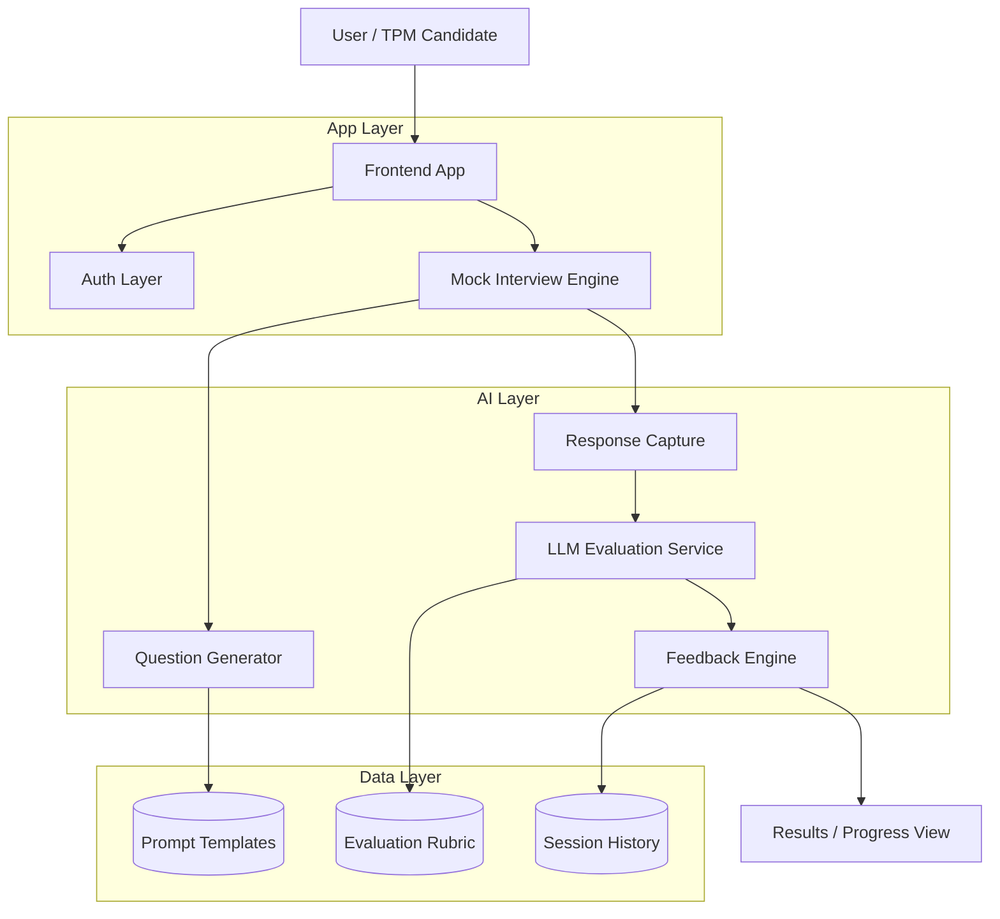

# TPM AI Mock Interview Prep

AI-powered mock interview prep platform built to help TPM candidates practice real interview scenarios with structured feedback, LLM-based evaluation, and a product-minded learning loop.

## Why this project
I built this to turn TPM interview prep from abstract theory into a hands-on product and system design exercise. The goal was to create something that reflects how modern TPMs think: define the problem, make tradeoffs, design the system, and iterate quickly [page:1].

## What it does
- Generates TPM-style mock interview questions.
- Captures candidate responses in a structured flow.
- Uses LLMs to evaluate answers and provide feedback.
- Supports iterative practice and improvement.
- Demonstrates end-to-end product thinking from idea to implementation [page:1].

## What it shows
- **Technical Program Management:** Breaking down ambiguity, driving execution, and making tradeoffs.
- **AI / LLM Product Skills:** Prompt engineering, evaluation design, and feedback loops.
- **System Design:** Modular architecture, scalability thinking, and service separation.
- **Product Judgment:** Choosing the right tools, balancing cost, quality, and maintainability [page:1].

## Architecture highlights
- Microservices-style separation for auth, questions, and feedback.
- PostgreSQL with JSONB for flexible AI feedback storage.
- OpenAI API integration with prompt optimization.
- Firebase Authentication for secure user management.
- Deployment and debugging experience across services [page:1].

## Key learnings
- LLM output quality improves dramatically with structured prompts.
- Good system design comes from clear tradeoffs, not just clean diagrams.
- Managed services can accelerate delivery without sacrificing quality.
- Owning the code means understanding it deeply, even when AI helps build it [page:1].

## Roadmap
- Add caching for faster question delivery.
- Improve feedback latency with async processing.
- Add voice-based interview simulation.
- Expand analytics for candidate progress.
- Explore personalization and model refinement [page:1].

## Architecture

## Related write-up
[Read the full blog post](https://medium.com/@aparajita.sahay87/from-theory-to-practice-what-building-my-own-tpm-interview-prep-app-taught-me-about-system-design-ddece00156b6) [page:1]
