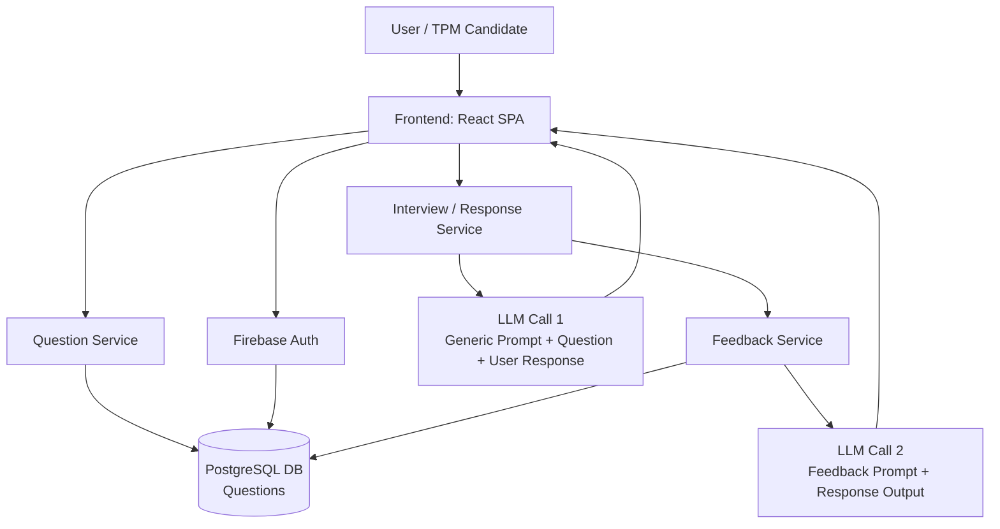

# TPM AI Mock Interview Prep

AI-powered mock interview platform built to help TPM candidates practice realistic interview scenarios with structured feedback, LLM-based evaluation, and a product-minded learning loop.

This project reflects the intersection of technical program management, AI product thinking, and system design. It was built to turn interview prep from theory into a practical, buildable system [page:1].

## Why this project

TPM interview prep is often expensive, abstract, and disconnected from real-world execution. I built this app to create a hands-on practice environment that simulates interview flow, evaluates responses, and provides actionable feedback [page:1].

## What it does

- Generates TPM-style interview questions.
- Captures candidate responses in a structured flow.
- Evaluates responses with LLM-powered prompts.
- Produces feedback to help users improve with each session.
- Demonstrates an end-to-end product experience from authentication to results [page:1].

## Architecture

## What this shows

- **Technical Program Management:** Breaking down ambiguity, sequencing work, and making tradeoffs across product and technical layers.
- **AI / LLM Product Skills:** Prompt design, response evaluation, and feedback-loop thinking.
- **System Design:** Service separation, dependency flow, and scalable architecture choices.
- **Execution Mindset:** Building a real product instead of discussing concepts in the abstract [page:1][web:11].

## Tech stack

- Firebase Authentication.
- Question service backed by a database.
- Interview / response service with one LLM call.
- Feedback service with a second LLM call.
- Frontend for displaying questions, responses, and feedback [page:1].

## Key learnings

- Managed auth keeps the system focused on core product value.
- Separating question, response, and feedback flows makes the architecture easier to reason about.
- LLM quality improves when prompts are scoped tightly to the task.
- Building the system creates stronger TPM stories than describing it theoretically.
- Real AI products require both technical rigor and product judgment [page:1].

## Roadmap

- Add caching for repeated question retrieval.
- Introduce async processing for feedback generation.
- Add analytics for user improvement trends.
- Explore voice-based interview simulation.
- Personalize practice based on user history and performance [page:1].

## Related write-up

Read the full blog post here: [From Theory to Practice: What Building My Own TPM Interview Prep App Taught Me About System Design and LLMs](https://medium.com/@aparajita.sahay87/from-theory-to-practice-what-building-my-own-tpm-interview-prep-app-taught-me-about-system-design-ddece00156b6) [page:1].
